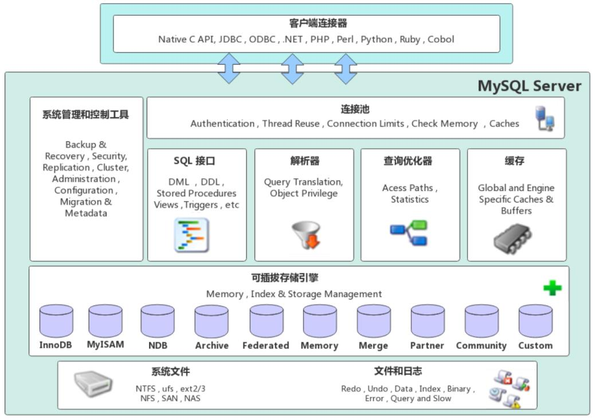
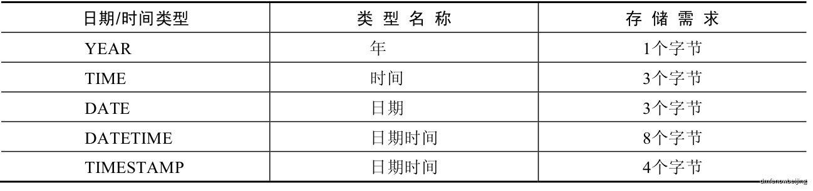
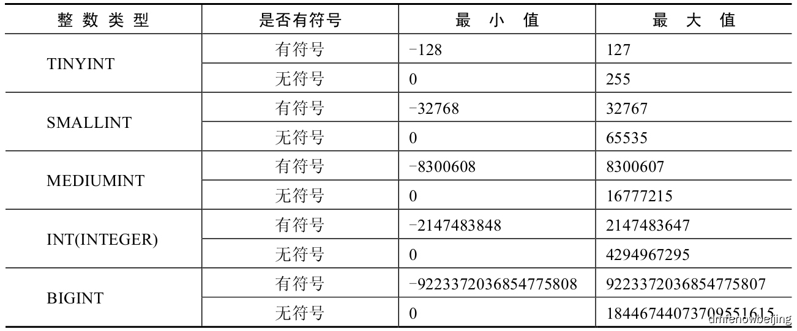

这篇文章用来记录Mysql的基本命令，以及后续遇到的一些知识和问题。

## 0x00 基本命令

### 数据库操作

- 登陆

```cmd
mysql -h localhost -P 3306 -u root -ppassword
```

localhost可以改成可以连接到的任意数据库，-P后面是端口，具体看数据库开放了哪个端口，默认是3306。

- 创建数据库

```mysql
create database database_name; #创建一个数据库
create database if not exists database_name; #创建一个数据库如果它不存在
```

- 显示数据库

```mysql
show database; #显示当前存在那些数据库
select database(); #查看当前命令行所在的数据库
```

- 切换数据库

```mysql
use database_name;
```

- 查看数据库创建信息

```mysql
show create database database_name;
show create database database_name \G
```

- 更改数据库名称

```mysql
rename database db_name to new_db_name #已经去掉了，由于此sql语句回造成数据丢失

#现行方法1
rename table test_old.table_test to test_new.table_test; #使用重命名的方式迁移表格
drop table if exists test_old; #删除数据库

#现行方法2
mysqldump -u root -p test_old > test_old_dump.sql; #导出数据库
use test_new;
source /path/to/sql/file/test_old_dump.sql; #导入到新的数据库
drop table if exists test_old;

#现行方法3
create table if not exists test_new.table_test like test_old.table_test;#通过复制表的方式
```

- 数据库编码

在MySQL中，会为创建的每个数据库指定一个字符编码。如果在创建数据库时没有为数据库指定字符编码，则MySQL会为数据库指定一个默认的字符编码，这个默认的字符编码在MySQL的配置文件my.cnf中进行配置。

```mysql
[client]
  default-character-set = utf8mb4
  [mysqld]
  character_set_server = utf8mb4
  [mysql]
  default-character-set=utf8mb4
```

或者在创建数据库时指定

```mysql
create database [if not exists] database_name default character set character_name collate collate_name [default encryption='N'];
#character 字符编码 eg.UTF-8
#collate 校验规则 eg.utf8_unicode_ci

show variables like '%character_set_database%'; #查看数据库字符编码
alter database database_name character set character_name collate collate_name;
#修改数据库字符编码
```

- 删除数据库

```
drop database [if exists] database_name;
```

### 数据表操作

- 创建数据表

```mysql
create table [if not exists] table_name(
	字段1,数据类型 [约束条件] [默认值],
	……
	[表约束条件]
	);
```

在创建数据表时，必须指定数据表的表名称，表名称在Windows操作系统上不区分大小写，在Linux操作系统上区分大小写。如果需要在Linux操作系统上不区分大小写，则需要在MySQL的配置文件my.cnf中添加一项配置。

------

```mysql
lower_case_table_names=1
```

==创建时指定主键==

```mysql
#单列主键
字段 数据类型 primary key [默认值] #在定义列时指定主键
[constraint 约束条件名] primary key [字段名] #在定义完所有列后指定主键

#多列联合主键
primary ky [字段1，字段2，字段3，……，字段n]
```

==也可以指定外键，从而来关联两张表格。==

指定的外键必须是另一张表的主键。一张表的外键可以不是本表的主键，但其对应着另一张表的主键。在一张表中定义了外键之后不允许删除另一张表中具有关联关系的行数据。

由外键引申出两个概念，分别是主表（父表）和从表（子表）。

主表（父表）：两个表具有关联关系时，关联字段中主键所在的表为主表（父表）。

从表（子表）：两个表具有关联关系时，关联字段中外键所在的表为从表（子表）。

```mysql
[constraint 外键名] foreign key 字段1 [,字段2，字段3，……]
	references 主表名 主键列1 [,主键列2，主键列3，……]
#外键名：定义外键时为数据表指定的外键名称。在同一张数据表中，外键的名称必须唯一。也就是说，在同一张数据表中，不能有相同名称的外键名称。
#FOREIGN KEY：指定外键包含哪些字段，可以是一个字段，也可以是多个字段的组合。
#REFERENCES：指定关联的主表名称。
#主表名：主键所在的表名称。
#主键列：主表中定义的主键字段，可以是一个字段，也可以是多个字段的组合。
```

==其他限定==

```mysql
字段名称 数据类型 not null #创建数据表时指定字段非空
字段名称 数据类型 default 默认值 #创建数据表时指定默认值
字段名称 数据类型 auto_increment #将整数类型的主键设置为默认递增类型

create table [if not exists] table_name()ENGINE=存储引擎名称; #创建数据表时指定存储引擎
default character set 编码 collate 校对规则 #创建数据表时指定编码
default charset=编码 collate=校对规则
```

- 查看数据表结构

```mysql
describe 表名称；
desc 表名称；

show create table 表名 \G #\G可以使输出结果信息更加美观，便于查看和阅读。
```

- 修改数据表

```mysql
alter table 原表名 rename [to] 新表明
```

- 增加字段

```mysql
alter table 表名 add column 新字段名 数据类型 [not null default 默认值]

#指定插入位置
alter table 表名 add column 新字段名 数据类型 [not null default 默认值] first;
alter table 表名 add column 新字段名 数据类型 [not null default 默认值] after 原有字段名;
```

- 修改字段名称

```mysql
alter table 表名 change 原有字段名 新字段名 新数据类型 #可以不改数据类型，但是数据类型不能为空
```

- 修改字段数据类型

```mysql
alter table 表名 modify 字段名 新数据类型 [default 默认值];
```

- 修改字段位置

```mysql
alter table 表名 modify 字段名 数据类型 first;
alter table 表名 modify 字段名 数据类型 after 字段名2;
```

- 删除字段

```mysql
alter table 表名 drop 字段名
```

- 修改表引擎

```mysql
alter table 表名 engine=存储引擎名称
```

- 取消数据表的外键约束

```mysql
alter table 表名 drop foreign key 外键名
```

- 删除数据表

```mysql
drop table [if exists] 数据表1 [,数据表2，……，数据表n]；#没有关联关系

#有关联关系
alter table 表名 drop foreign key 外键名
drop table [if exists] 数据表1 [,数据表2，……，数据表n]；
```


- 

## 0x01 相关知识

### Mysql体系结构



#### InnoDB 存储引擎（默认）

(1) 支持自动增长列AUTO_INCREMENT。自动增长列的值不能为空，且值必须唯一。MySQL中规定自增列必须为主键。

(2) 支持外键，保证数据的完整性和正确性。外键所在表为子表，外键所依赖的表为父表。父表中被子表外键关联的字段必须为主键。

(3) DML操作遵循ACID模型，支持事务。

(4) 行级锁 ，提高并发访问性能。

(5)表空间文件：xxx.ibd：xxx代表的是表名，innoDB引擎的每张表都会对应这样一个表空间文件，存储该表的表结构（frm、sdi(8.0之后)）、数据和索引。

**优点**
提供良好的事务管理、崩溃修复能力和并发控制
**缺点**
读写效率稍差，占用的数据空间相对较大

#### MyISAM 存储引擎

(1) 不支持事务，不支持外键

(2) 支持表锁，不支持行锁

(3) 占用空间小，访问速度快

MyISAM存储引擎的文件类型：xxx.sdi：存储表结构信息 (8.0以后)；xxx.MYD: 存储数据；xxx.MYI: 存储索引

#### Memory 存储引擎

(1) 内存存放
(2) hash索引（默认）

xxx.sdi：存储表结构信息


### Mysql数据类型

#### 整型

MySQL中的整数类型包括TINYINT、SMALLINT、MEDIUMINT、INT(INTEGER)和BIGINT。不同的整数类型，其所需要的存储空间和数值范围不尽相同。





`CREATE TABLE t2(id INT(6));`指定的是显示宽度，只要不溢出都不会报错，`CREATE TABLE t3(id1 INT ZEROFILL, id2 INT(6) ZEROFILL);`可以用0填充高位数。

所有的整数类型都有一个可选的属性UNSIGNED（无符号属性），无符号整数类型的最小取值为0。所以，如果需要在MySQL数据库中保存非负整数值时，可以将整数类型设置为无符号类型。特别地，如果在MySQL中创建数据表时，指定数据字段为ZEROFILL，则MySQL会自动为当前列添加UNSIGNED属性。

#### 浮点数

浮点数类型主要有两种：单精度浮点数FLOAT和双精度浮点数DOUBLE。


对于浮点数来说，可以使用(M,D)的方式进行表示，(M,D)表示当前数值包含整数位和小数位一共会显示M位数字，其中，小数点后会显示D位数字，M又被称为精度，D又被称为标度。

```mysql
mysql> CREATE TABLE t7 (    
	-> f FLOAT(5,2),    
	-> d DOUBLE(5,2)    
	-> );
```

#### 定点数

MySQL中的定点数类型只有DECIMAL一种类型。DECIMAL类型也可以使用(M,D)进行表示，其中，M被称为精度，是数据的总位数；D被称为标度，表示数据的小数部分所占的位数。定点数在MySQL内部是以字符串的形式进行存储的，它的精度比浮点数更加精确，适合存储表示金额等需要高精度的数据。

DECIMAL(M,D)类型的数据的最大取值范围与DOUBLE类型一样，但是有效的数据范围是由M和D决定的。而DECIMAL的存储空间并不是固定的，由精度值M决定，总共占用的存储空间为M+2个字节。定点数类型中的DECIMAL类型不指定精度时，默认为DECIMAL(10,0)。

